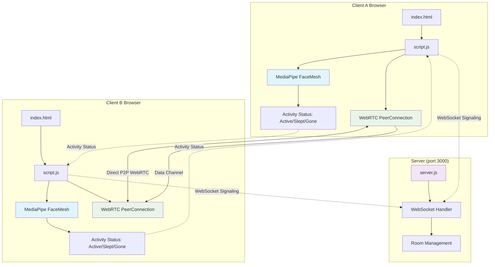

# WebRTC Video Conferenc### 👁️ Activity Detection (Awake/Asleep/Gone)
- **MediaPipe FaceMesh integration** for real-time eye tracking
- **Eye Aspect Ratio (EAR) calculation** to detect eye closure
- **Presence detection** to identify when participants have left their camera
- **Visual status indicators**: 🙂 Active, 😴 Slept, 👻 Gone, ⏳ Checking...
- **Smart dwell time logic** to prevent false positives
- **Works with network adaptation** - continues during audio-only mode for local user
- **Data channel transmission** - activity status sent even in audio-only mode
- **Audio mode indicators**: Shows "(Audio)" when status received via data transmissionication with Adaptive Network Optimization

# WebRTC Video Conference Application with Adaptive Network Optimization

A modern, Google Meet-style WebRTC video conferencing application with advanced network adaptation features, active speaker detection, real-time activity monitoring (awake/asleep detection), and intelligent quality management with data channel status transmission.

## 🎯 Key Features

### ✨ Modern UI Design
- **Google Meet-inspired interface** with Inter font and dark theme (#0f1113)
- **Responsive CSS Grid layout** that adapts to 1-9 participants
- **Hover effects and smooth animations** with backdrop filters
- **Professional participant tiles** with rounded corners and shadows

### 🔄 Adaptive Network Management
- **Real-time network monitoring** every 3 seconds
- **Intelligent quality adaptation** based on bandwidth, RTT, and packet loss
- **Audio-only fallback** for severe network conditions
- **Smart recovery logic** that prevents quality flapping

### 🎵 Active Speaker Detection
- **Web Audio API integration** for real-time audio level monitoring
- **Visual highlighting** of active speakers with blue borders
- **Bandwidth optimization** prioritizing active speakers
- **3-person layout optimization** with main speaker positioning

### �️ Activity Detection (Awake/Asleep)
- **MediaPipe FaceMesh integration** for real-time eye tracking
- **Eye Aspect Ratio (EAR) calculation** to detect eye closure
- **Visual status indicators**: 🙂 Active, 😴 Slept, ⏳ Checking...
- **Smart dwell time logic** to prevent false positives
- **Works with network adaptation** - continues during audio-only mode for local user

### �📊 Network Statistics Display
- **Real-time stats panel** in top-right corner
- **Comprehensive metrics**: Participant count, bandwidth, packet loss, RTT
- **Quality indicators** with color-coded status
- **Adaptive mode status** showing ON/OFF state

## 🛠️ Technical Architecture

### Network Quality Thresholds

```javascript
const BANDWIDTH_THRESHOLDS = {
  LOW: 150000,    // 150 kbps - minimum for low quality video
  MEDIUM: 500000, // 500 kbps - medium quality video threshold  
  HIGH: 1000000   // 1 Mbps - high quality video threshold
};
```

### Quality Assessment Criteria

#### 🔴 AUDIO_ONLY Mode
- **RTT > 3000** OR **Packet Loss > 15%**
- Video transmission disabled, audio prioritized
- Local video preview maintained for user positioning

#### 🟡 LOW Quality (160x120@15fps)
- **RTT: 400-500ms** OR **Packet Loss: 8-15%** OR **Bitrate: 60-150 kbps**
- Max bitrate: 200 kbps, priority: low

#### 🟠 MEDIUM Quality (320x240@24fps) 
- **RTT: 200-400ms** OR **Packet Loss: 3-8%** OR **Bitrate: 150-500 kbps**
- Max bitrate: 600 kbps, priority: medium

#### 🟢 HIGH Quality (640x480@30fps)
- **RTT < 150ms** AND **Packet Loss < 2%** AND **Good bitrate**
- Max bitrate: 1.2 Mbps, priority: high

### Video Quality Constraints

```javascript
const VIDEO_CONSTRAINTS = {
  LOW:    { width: 160, height: 120, frameRate: 15 },
  MEDIUM: { width: 320, height: 240, frameRate: 24 },
  HIGH:   { width: 640, height: 480, frameRate: 30 }
};
```

## 🎵 Audio-Only Mode Features

### Smart Local Video Handling
- **Local camera preview**: Always visible when camera is on
- **Visual indicator**: Orange "🎵 Not Transmitting" badge
- **No bandwidth usage**: Local preview doesn't consume network resources
- **Camera controls**: Remain fully functional

### Remote Participant Experience
- **Video placeholder**: 🎵 "Audio Only" symbol with text
- **Audio maintained**: Full audio communication continues
- **Bandwidth savings**: ~90% reduction in data usage
- **Visual feedback**: Orange styling indicates audio-only state

## 📊 Network Monitoring System

### Statistics Collection
- **Outbound RTP stats**: Packet sending rates, bytes transmitted
- **Remote inbound stats**: Packet loss from receiver perspective  
- **Candidate pair stats**: Round-trip time measurements
- **Audio level monitoring**: Active speaker detection

### Packet Loss Calculation Priority
1. **Remote-inbound-rtp reports** (most accurate)
2. **Inbound-rtp reports** (fallback)
3. **Outbound-rtp reports** (last resort)

### Safety Mechanisms
- **Initial connection protection**: No adaptation for first 10 seconds
- **Minimum sample size**: Requires >100 packets for loss calculation
- **Value capping**: Packet loss limited to 0-50% range
- **Negative delta protection**: Prevents counter reset issues

## 🔄 Adaptive Logic Flow

### Quality Degradation Path
```
HIGH → MEDIUM → LOW → AUDIO_ONLY
```

### Recovery Intelligence
- **Connection quality focus**: Uses RTT and packet loss for recovery decisions
- **Bitrate filtering**: Ignores low bitrate when in audio-only mode (prevents trap)
- **Gradual upgrades**: AUDIO_ONLY → LOW → MEDIUM → HIGH
- **Stability requirements**: Sustained good conditions needed for upgrades

### Recovery Triggers
```javascript
// From AUDIO_ONLY to LOW
if (currentVideoQuality === 'AUDIO_ONLY' && 
    maxPacketLoss < 2 && maxRtt < 150) {
    targetQuality = 'LOW';
}
```

## 🎯 Active Speaker Detection

### Audio Level Monitoring
- **Sample rate**: Updated every 200ms
- **Threshold**: -50 dB for voice activity detection
- **Smoothing**: Exponential moving average to prevent flicker
- **Silence detection**: Automatic fallback when no one speaks

### Bandwidth Optimization
```javascript
// Active speaker gets high quality
params.encodings[0].maxBitrate = 1200000; // 1.2 Mbps
params.encodings[0].priority = 'high';

// Background participants get reduced quality  
params.encodings[0].maxBitrate = 600000; // 600 kbps
params.encodings[0].priority = 'medium';
```

## �️ Activity Detection System

### Eye Aspect Ratio (EAR) Algorithm
```javascript
// Detection thresholds
const EYE_EAR_THRESHOLD = 0.30; // Higher threshold detects closures sooner
const SLEEP_MS = 800;           // Time before marking as 'slept' 
const WAKE_MS = 250;            // Time before marking as 'active'
const GONE_MS = 3000;           // Time with no face before marking as 'gone'

// MediaPipe FaceMesh eye landmarks
const LEFT_EYE = [33, 160, 158, 133, 153, 144];
const RIGHT_EYE = [362, 385, 387, 263, 373, 380];
```

### Activity Status Logic
- **🙂 Active**: Face detected with eyes open for > 250ms
- **😴 Slept**: Face detected with eyes closed for > 800ms
- **👻 Gone**: No face detected for > 3000ms (participant left camera)
- **⏳ Checking**: Initial state or transitioning between states

### Detection State Machine
```javascript
// Three detection states
'face-open'   -> Active (eyes open, person present)
'face-closed' -> Slept (eyes closed, person present)
'no-face'     -> Gone (no person detected)

// State transitions with dwell time prevent false positives
if (detectionState === 'face-open' && timeSinceChange > WAKE_MS) {
  status = 'active';
} else if (detectionState === 'face-closed' && timeSinceChange > SLEEP_MS) {
  status = 'slept';  
} else if (detectionState === 'no-face' && timeSinceChange > GONE_MS) {
  status = 'gone';
}
```

### MediaPipe Integration
```javascript
// FaceMesh configuration
fm.setOptions({
  maxNumFaces: 1,
  refineLandmarks: true,
  minDetectionConfidence: 0.5,
  minTrackingConfidence: 0.5
});
```

### Network Mode Compatibility
- **Normal mode**: Activity detection for all participants with video
- **Audio-only mode**: Local user activity detection continues, status transmitted via data channels
- **Remote participants in audio-only**: Receive activity status via WebRTC data channels
- **Data channel transmission**: Minimal bandwidth usage (~50 bytes per status update)
- **Visual indicators**: Shows "(Audio)" suffix when status is transmitted rather than locally detected
- **Camera off**: Activity detection automatically disabled
- **Reconnection**: Activity detection restarts when video streams resume

### Data Channel Implementation
```javascript
// Activity status transmission
const activityChannel = pc.createDataChannel('activity', { ordered: true });

// Broadcast local activity status to all peers
broadcastActivityStatus(status) {
  peerConnections.forEach((pc, peerId) => {
    if (pc.activityChannel?.readyState === 'open') {
      pc.activityChannel.send(JSON.stringify({
        type: 'activity-status',
        status: status,
        timestamp: Date.now()
      }));
    }
  });
}
```

## �📱 Responsive Grid Layouts

### Participant Count Adaptations
- **Single (1)**: Centered video, max 900px width, 16:9 aspect ratio
- **Double (2)**: Side-by-side layout, equal columns
- **Triple (3)**: 2 top + 1 bottom spanning, active speaker prominence
- **Quad (4)**: 2x2 grid layout
- **5-6**: 3-column layouts with strategic spanning
- **7-8**: 4x2 grid for optimal space usage
- **9+**: Auto-fit grid with 240px minimum tile size

### Mobile Responsiveness
```css
@media (max-width: 768px) {
  .video-grid {
    grid-template-columns: repeat(auto-fit, minmax(180px, 1fr));
    grid-auto-rows: minmax(100px, auto);
  }
}
```

## 🛡️ Connection Resilience

### ICE Configuration
```javascript
iceServers: [
  { urls: 'stun:stun.l.google.com:19302' },
  { urls: 'stun:stun1.l.google.com:19302' },
  { urls: 'stun:stun2.l.google.com:19302' },
  { urls: 'stun:stun.services.mozilla.com' },
  { urls: 'stun:stun.stunprotocol.org:3478' },
  { urls: 'stun:openrelay.metered.ca:80' }
]
```

### Error Handling & Recovery
- **Connection timeout**: 15-second limit with automatic retry
- **ICE failure recovery**: Automatic ICE restart on connection failure
- **Peer reconnection**: 3-second delay before reconnection attempt
- **Data channel heartbeat**: 30-second ping/pong for connection monitoring

## 🎨 UI/UX Features

### Visual Feedback
- **Connection status colors**: Green (connected), Yellow (connecting), Red (failed)
- **Quality indicators**: Color-coded network status with emoji icons  
- **Participant info**: Hover effects and connection state display
- **Mute indicators**: Visual feedback for audio/video states

### Control Interface
- **Join/Leave buttons**: One-click meeting access
- **Audio/Video toggles**: Instant mute/unmute functionality
- **Adaptive mode control**: Manual override for network adaptation
- **Stats panel**: Real-time network information display

## 🔧 Configuration Options

### Network Monitoring Intervals
- **Quality monitoring**: Every 3000ms (3 seconds)
- **Active speaker detection**: Every 200ms  
- **Stats panel update**: Every 2000ms (2 seconds)
- **Connection heartbeat**: Every 30000ms (30 seconds)

### Customizable Thresholds
All thresholds can be adjusted by modifying the constants at the top of `script.js`:

```javascript
// Bandwidth thresholds for quality decisions
const BANDWIDTH_THRESHOLDS = { ... }

// Video quality constraints
const VIDEO_CONSTRAINTS = { ... }

// Active speaker detection sensitivity
const VOICE_ACTIVITY_THRESHOLD = -50; // dB

// Update intervals
const SPEAKER_UPDATE_INTERVAL = 200; // ms
```

## 🚀 Getting Started

### 📁 Project Structure

```
webrtc-demo/
├── 📄 README.md                    # 📖 This comprehensive documentation
├── 📄 package.json                 # 🔴 REQUIRED: Node.js dependencies (Express, WebSocket)
├── 📄 package-lock.json           # 🔴 REQUIRED: Dependency version lock
├── 📄 server.js                   # 🔴 REQUIRED: Main WebSocket server (port 3000)
├── 📄 .gitignore                  # 🟡 OPTIONAL: Git ignore patterns
├── 📄 tunnel-alternative.js       # 🟢 UNUSED: Alternative tunneling setup (can delete)
├── 📁 node_modules/               # 🔴 REQUIRED: NPM dependencies (auto-generated)
│
└── 📁 public/                     # Client-side files (served by Express)
    ├── 🌐 index.html              # 🔴 REQUIRED: Main application UI (Google Meet style)
    ├── ⚡ script.js               # 🔴 REQUIRED: Enhanced WebRTC with activity detection
    │
    ├── 📜 Legacy Files (can be safely deleted):
    ├── ⚡ script_adaptive.js      # 🟢 BACKUP: Network adaptation version
    ├── ⚡ script_enhanced.js      # 🟢 BACKUP: Enhanced version backup  
    ├── ⚡ script_original_backup.js # 🟢 BACKUP: Original implementation
    │
    └── 📜 Integrated Source Files (can be safely deleted):
        ├── 🌐 sentimental-index.html   # 🟢 SOURCE: Original activity detection UI
        └── ⚡ sentimental-script.js    # 🟢 SOURCE: Original activity detection logic
```

### 🎯 File Priority Guide

| Status | Files | Purpose | Action |
|--------|-------|---------|---------|
| 🔴 **CRITICAL** | `server.js`, `package.json`, `package-lock.json`, `public/index.html`, `public/script.js`, `node_modules/` | Core application functionality | **MUST KEEP** |
| 🟡 **HELPFUL** | `README.md`, `.gitignore` | Documentation and Git management | **RECOMMENDED** |
| 🟢 **OPTIONAL** | `script_*.js`, `sentimental-*`, `tunnel-alternative.js` | Development history and unused code | **CAN DELETE** |

### 🧹 Cleanup Commands (Optional)

If you want to clean up the project, run these commands to remove optional files:

```powershell
# Remove backup script versions (features already integrated into script.js)
Remove-Item public\script_adaptive.js
Remove-Item public\script_enhanced.js  
Remove-Item public\script_original_backup.js

# Remove original source files (features already integrated)
Remove-Item public\sentimental-index.html
Remove-Item public\sentimental-script.js

# Remove unused alternative setup
Remove-Item tunnel-alternative.js
```

### 🔧 Key Files Explained

#### **Core Application Files**
| File | Purpose | Key Features |
|------|---------|--------------|
| `server.js` | WebSocket server | Real-time communication, room management |
| `public/index.html` | Main UI | Google Meet styling, responsive grid layout |
| `public/script.js` | Main logic | WebRTC + Network adaptation + Activity detection |

#### **Enhanced Features Integration**
- **Activity Detection**: Integrated from `sentimental-*` files into main app
- **Network Adaptation**: Advanced bandwidth management and quality adjustment  
- **Audio-Only Transmission**: Continues activity detection via data channels
- **Multi-State Detection**: Active (🙂), Slept (😴), Gone (👻), Checking (⏳)

#### **Configuration Files**
- **`package.json`**: Dependencies (Express 5.1.0, WebSocket 8.18.3)
- **`server.js`**: WebSocket server on port 3000 with room management
- **`.gitignore`**: Excludes node_modules and environment files

### 🔄 Data Flow Architecture



### Prerequisites
- **Node.js** (v14 or higher) - [Download here](https://nodejs.org/)
- **Modern web browser** with WebRTC support (Chrome, Firefox, Safari, Edge)
- **Camera and microphone** access permissions
- **HTTPS/Local server** required for WebRTC security
- **Internet connection** for MediaPipe FaceMesh CDN access
- **Multiple devices** recommended for testing full WebRTC functionality

### 🚀 Quick Start (Single Device Testing)

1. **Install dependencies** (already done if you see node_modules folder):
```bash
npm install
```

2. **Start the WebSocket server**:
```bash
node server.js
```

3. **Open application**:
   - Go to `http://localhost:3000`
   - Open multiple browser tabs to test locally
   - Allow camera/microphone permissions when prompted

### ✅ Verification Steps

After running `node server.js`, you should see:
```
Server running on port 3000
WebSocket server ready
Express server serving static files from public/
```

**Test the application**:
- Open `http://localhost:3000` in two browser tabs
- Click "Join Room" in both tabs
- You should see both video feeds and activity detection working

### 🔧 Troubleshooting

**Server won't start?**
```bash
# Check if port 3000 is in use
netstat -an | findstr :3000

# Try a different port
set PORT=3001 && node server.js
```

**Dependencies missing?**
```bash
# Reinstall dependencies
rm -rf node_modules package-lock.json
npm install
```

### 🎛️ Setup Options

#### **Minimal Setup** (4 files only)
For basic functionality, you only need:
```
webrtc-demo/
├── 📄 package.json       # Dependencies
├── 📄 server.js         # WebSocket server  
└── 📁 public/
    ├── index.html       # UI
    └── script.js        # WebRTC logic
```

#### **Full Development Setup** (all files)
Includes documentation, backups, and source files:
```
webrtc-demo/
├── All core files above
├── 📄 README.md         # This documentation
├── 📄 .gitignore        # Git configuration
├── Multiple script_*.js # Development versions
└── sentimental-*        # Original source files
```

**Recommendation**: Keep all files for now, delete optional ones later if needed.

### Multi-Device Setup (Recommended)

#### Option 1: VS Code Port Forwarding (Easiest)
1. **Start the server**: Run `npm start` in your VS Code terminal
2. **Open Ports tab**: In VS Code, go to "Ports" tab (next to Terminal)
3. **Forward port 3000**: Click "Add Port" → Enter `3000` → Set visibility to "Public"
4. **Copy the forwarded URL**: VS Code provides a public URL (e.g., `https://xxx-3000.app.github.dev`)
5. **Access from other devices**: Open the public URL on phones, tablets, other computers

#### Option 2: ngrok (Alternative)
```bash
# Install ngrok (one-time setup)
npm install -g ngrok

# Start your server
npm start

# In another terminal, expose port 3000
ngrok http 3000

# Use the https:// URL provided by ngrok on other devices
```

#### Option 3: Local Network Access
```bash
# Start server with host binding
node server.js --host 0.0.0.0

# Find your local IP address:
# Windows: ipconfig
# Mac/Linux: ifconfig or ip addr

# Access from other devices on same network:
# http://YOUR_LOCAL_IP:3000 (e.g., http://192.168.1.100:3000)
```

#### 🔒 Security & Best Practices

**For Development/Testing:**
- **VS Code Port Forwarding**: Safest option, automatically handles HTTPS
- **ngrok**: Good for external testing, provides HTTPS by default
- **Local network**: Only use on trusted networks (home/office WiFi)

**Important Security Notes:**
- **Never expose production**: These methods are for development only
- **Temporary access**: Stop port forwarding when done testing
- **HTTPS required**: WebRTC requires secure context for camera/microphone
- **Firewall awareness**: Port forwarding may bypass some security measures

**Recommended Testing Flow:**
1. **Start locally**: Test basic functionality with browser tabs
2. **VS Code forwarding**: Test with phone/tablet on same network
3. **External devices**: Use ngrok for testing from different networks
4. **Production deployment**: Use proper hosting with SSL certificates

### Step-by-Step Testing Guide

#### 1. Initial Setup
```bash
# Install dependencies
npm install

# Start the WebSocket server
npm start
# ✅ Server should start on http://localhost:3000
```

#### 2. Single Device Test
1. Open **two browser tabs** to `http://localhost:3000`
2. **Grant permissions** for camera/microphone in both tabs
3. Click **"Join Meeting"** in both tabs
4. **Verify**: You should see yourself and the other tab participant
5. **Test features**: Check activity detection, network stats, audio-only mode

#### 3. Multi-Device Test (Real WebRTC)
1. **Setup port forwarding** using one of the methods above
2. **Primary device**: Open the local URL (`http://localhost:3000`)
3. **Secondary devices**: Open the forwarded/public URL
4. **Join meeting** from all devices
5. **Test real scenarios**:
   - Poor network conditions
   - Different device types (phone, tablet, laptop)
   - Activity detection across devices
   - Audio-only mode when network is poor

### Troubleshooting Common Issues

#### ❌ "Server failed to start"
- **Check port**: Ensure port 3000 is not in use
- **Install dependencies**: Run `npm install`
- **Check Node version**: Requires Node.js 14+ 

#### ❌ "Camera/microphone not working"
- **HTTPS required**: WebRTC needs secure context (HTTPS or localhost)
- **Grant permissions**: Check browser permission settings
- **Test hardware**: Verify camera/mic work in other apps

#### ❌ "Cannot connect between devices"
- **Firewall**: Ensure port 3000 is not blocked
- **Network**: Devices must reach the server
- **HTTPS for remote**: Use ngrok or VS Code forwarding for external access

#### ❌ "Activity detection not working"
- **MediaPipe loading**: Check browser console for CDN errors
- **Face visibility**: Ensure face is well-lit and visible
- **Camera permissions**: Activity detection requires video access

### 🧪 Testing Activity Detection Features

#### Multi-Device Activity Testing
1. **Setup two devices** using port forwarding methods above
2. **Join meeting** from both devices
3. **Test activity states** on Device A while watching Device B:
   - **🙂 Active**: Look directly at camera with eyes open
   - **😴 Slept**: Close eyes for 1+ seconds
   - **👻 Gone**: Move completely out of camera view for 3+ seconds
   - **⏳ Checking**: Should appear briefly during transitions

#### Audio-Only Mode Testing
1. **Simulate poor network**: Use browser dev tools to throttle network
2. **Trigger audio-only mode**: Network should automatically adapt
3. **Verify activity transmission**: Activity status should still update with "(Audio)" suffix
4. **Local video preservation**: Your own video should remain visible even in audio-only

#### Network Adaptation Testing
1. **Monitor stats panel**: Watch real-time network metrics in top-right
2. **Test quality changes**: Network should adapt between HIGH/MEDIUM/LOW/AUDIO_ONLY
3. **Verify packet loss calculation**: Should show realistic values (not 100%)
4. **Test recovery**: Network should improve quality when conditions get better

### Development Setup
```bash
# Using Node.js http-server
npm install -g http-server
http-server -p 3000

# Using Python
python -m http.server 3000

# Using Node.js with WebSocket support
node server.js
```

## 📈 Performance Optimizations

### Bandwidth Management
- **Dynamic bitrate adjustment**: Based on network conditions
- **Audio prioritization**: Maintains call quality in poor conditions  
- **Background participant optimization**: Reduces quality for non-speakers
- **Adaptive frame rates**: Adjusts based on network capacity

### Memory Efficiency
- **Stream cleanup**: Proper disposal of media tracks
- **Event listener management**: Prevents memory leaks
- **Participant object lifecycle**: Clean creation and removal

### CPU Optimization  
- **Efficient audio analysis**: Optimized FFT processing
- **Throttled updates**: Prevents excessive re-renders
- **Smart grid recalculation**: Only when participant count changes

## 🐛 Troubleshooting

### Common Issues

#### Video Not Displaying
- Check camera permissions in browser
- Verify HTTPS/localhost requirement for WebRTC
- Toggle camera button to refresh stream

#### Audio-Only Mode Stuck
- Fixed in latest version with smart recovery logic
- Monitor console for quality assessment logs
- Check RTT and packet loss values in stats panel

#### Connection Problems
- Verify STUN server accessibility
- Check firewall settings for WebRTC traffic
- Review browser console for detailed error messages

### Debug Information
Enable debug logging by opening browser console (F12) to see:
- Network quality assessments
- Connection state changes
- Audio level measurements
- Quality adaptation decisions

## 🔬 Technical Implementation Details

### WebRTC Stack
- **Peer-to-peer connections** with fallback STUN servers
- **Unified Plan SDP** for modern browser compatibility
- **Bundle policy**: Maximized for connection efficiency
- **RTCP mux policy**: Required for optimal performance

### Audio Processing
- **Web Audio API**: Real-time audio level analysis
- **Echo cancellation**: Enabled by default
- **Noise suppression**: Hardware-accelerated when available
- **Auto gain control**: Maintains consistent audio levels

### Video Processing
- **Hardware acceleration**: Utilizes GPU when available
- **Constraint-based adaptation**: Dynamic resolution/framerate
- **Encoding parameter control**: Bitrate and priority management
- **Track management**: Enable/disable without stream recreation

## 📊 Metrics & Analytics

### Collected Metrics
- **Video bitrate**: Bytes per second transmitted/received
- **Audio bitrate**: Audio data transmission rates
- **Packet loss**: Percentage of lost packets
- **Round-trip time**: Network latency measurements
- **Jitter**: Variation in packet arrival times
- **Connection states**: Detailed peer connection status

### Performance Monitoring
- **Frame rate tracking**: Actual vs target frame rates
- **Resolution tracking**: Current video dimensions
- **Audio levels**: Real-time voice activity detection
- **Network adaptation events**: Quality change logging

## 🔒 Security Considerations

### Privacy
- **Peer-to-peer**: No server-side media processing
- **Local preview**: Camera feed never leaves device unnecessarily
- **Permission-based**: Explicit user consent for media access

### Network Security  
- **STUN-only**: No TURN servers reduce privacy exposure
- **Encrypted connections**: All WebRTC traffic is encrypted
- **Origin restrictions**: Same-origin policy enforcement

## 🚀 Quick Command Reference

### Essential Commands
```bash
# Basic setup
npm install
npm start

# VS Code users (easiest multi-device)
# 1. Run: npm start
# 2. Ports tab → Add Port → 3000 → Public
# 3. Use the provided public URL on other devices

# ngrok setup
npm install -g ngrok
npm start
ngrok http 3000    # In separate terminal

# Local network (same WiFi only)
# Windows: ipconfig | findstr IPv4
# Mac/Linux: ifconfig | grep inet
# Then use: http://YOUR_IP:3000
```

### Testing Checklist
- [ ] Single device (browser tabs)
- [ ] Multi-device via port forwarding
- [ ] Camera/microphone permissions granted
- [ ] Activity detection working (🙂😴👻)
- [ ] Network adaptation (check stats panel)
- [ ] Audio-only mode transmission
- [ ] Data channel communication

---

## 📄 License

MIT License - Feel free to use, modify, and distribute.

## 🤝 Contributing

Contributions welcome! Please read the code structure and follow the established patterns for network adaptation and UI management.

---

*Built with ❤️ using modern WebRTC APIs, advanced network optimization, and responsive design principles.*